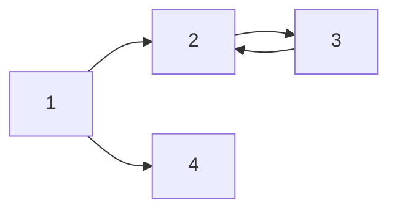

\# 은 Header를 의미합니다.

# H1 tag

## H2 tag

### H3 tag

#### H4 tag

##### H5 tag

\# 를 5개 이상 쓴다는 것? -> 잘못된 분류!!

---

*hello*

_italic_

**bold**

***italic+bold***

**_italic+bold_**


~~hello~~

> 안녕하세요 이건 Quote 입니다.

---

- list 1
* list 1
- list 2
- list 3
  - A
    - B

- **무결성** :
- **간결성** :

1. list 1
3. list 2
3. list 3
   1. A
      1. B

|제목|description|비교|
|-|-|-|
|안녕|1|2|
|할로|3|4|


---

[링크이름](naver.com)

<a href="naver.com">링크이름</a>


[uhmky7의 블로그](uhmky7.github.io)


---

`simple code`

``` cpp
#include <stdio.h>

int main(){
    printf("hello world");
    return 0;
}
```

---

hello $ a + b $ hello

$ a^2_1 + b^2 = c^2 $

다음 중 $N$개를 고르시오.

hello$$ (\alpha + \beta)^2 = \alpha^2 + 2 \alpha \beta + \beta^2 $$helllo

$$min_G max_D$$

$\alpha \beta \frac{1}{2}$

---




1607536595549


insertDateString.insertOwnFormatDateTime
"insertDateString.insertOwnFormatDateTime"
